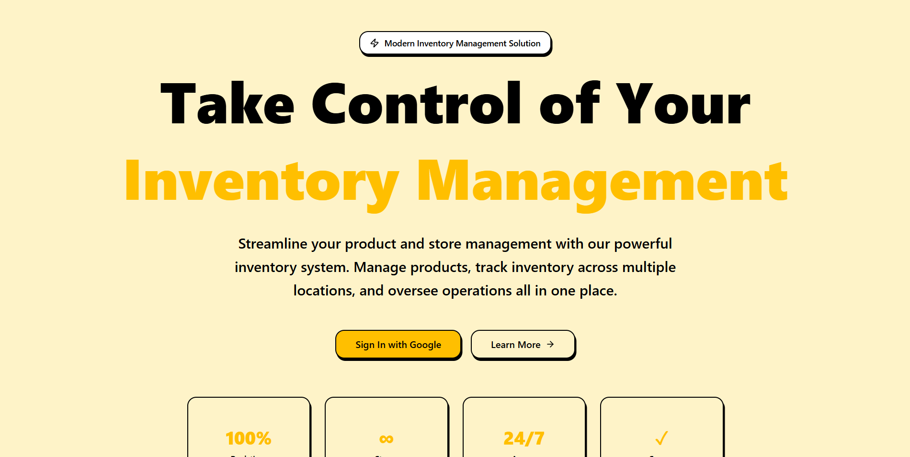
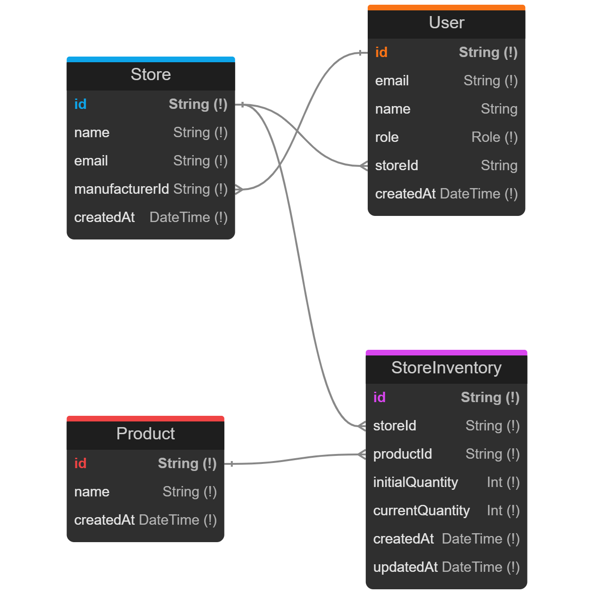

# INSYD - Inventory Management System



A comprehensive inventory management system designed for Indian material businesses to track inventory across multiple retail stores in real-time. This application enables manufacturers to manage products and stores while providing store owners with tools to track their inventory levels.

> 📖 **For detailed technical documentation, problem analysis, and implementation details, see [DOCUMENTATION.md](./DOCUMENTATION.md)**

## Problem Statement

Most Indian material businesses have no visibility over their inventory levels. This leads to:
- **Low net margins** due to dead inventory, poor-performing SKUs, and damaged inventory
- **Low confidence** in their ability to scale operations
- **Manual tracking errors** and delays
- **Inconsistent product information** across different stores
- **Insufficient data** to identify poor-performing SKUs

## Proposed Solutions

INSYD addresses these challenges through five key solutions:

### 1. Real-Time Inventory Visibility
- **Problem**: Lack of visibility over inventory levels across multiple stores
- **Solution**: A centralized inventory management system that provides real-time stock visibility for both manufacturers (across all stores) and individual store owners
- **Benefit**: Immediate awareness of stock levels, quick identification of over/understocked items

### 2. Automated Inventory Tracking
- **Problem**: Manual tracking leads to errors and delays
- **Solution**: A digital system that automatically updates inventory upon product sale or addition, maintaining records of initial and current quantities
- **Benefit**: Eliminates calculation errors and prevents discrepancies

### 3. Multi-Store Management
- **Problem**: Difficulty in managing inventory across multiple store locations
- **Solution**: Role-based access control, allowing manufacturers to create and manage the overall structure while store owners manage inventory for their individual stores
- **Benefit**: Centralized control with delegated management

### 4. Product Catalog Management
- **Problem**: Inconsistent product information across different stores
- **Solution**: A centralized product catalog ensures all stores access the same product database
- **Benefit**: Standardized information and consistent SKU management

### 5. Inventory Analytics Foundation
- **Problem**: Insufficient data to identify poor-performing SKUs (dead inventory)
- **Solution**: The system tracks initial and current quantities, forming the necessary data foundation for future analytics
- **Benefit**: Enables identification of inventory turnover patterns and supports data-driven decisions

## Overview

INSYD is a role-based inventory management system that solves critical inventory visibility challenges faced by material businesses. The system provides real-time inventory tracking, multi-store management, and a foundation for inventory analytics.

## Key Features

### User Authentication & Authorization
- Google OAuth integration for secure sign-in
- Role-based access control for two main roles: Manufacturer and Store
- Session management and secure authentication

### Manufacturer Dashboard
- **Product Management**: Create and view all products in a centralized catalog
- **Store Management**: Create new stores and assign store owners with unique email addresses
- **Inventory Overview**: Multi-store visibility to monitor inventory levels across all managed stores from a single dashboard
- **Full System Control**: Complete visibility and control over products, stores, and inventory

### Store Owner Dashboard
- **Inventory Management**: Add products with initial quantities, choosing from the manufacturer's central product catalog
- **Stock Updates**: Increase current inventory quantities when restocking
- **Inventory Viewing**: View stock levels, tracking both initial and current quantities for their individual store
- **Product Selection**: Access to the complete manufacturer product catalog

### Inventory Tracking System
- Tracks both `initialQuantity` and `currentQuantity` for every product-store combination
- Ensures automatic updates on inventory changes
- Includes unique constraint to prevent duplicate entries
- Timestamp tracking for audit purposes

## Project Flow & Architecture

### Role-Based System

The application is divided into two distinct roles:

1. **Manufacturer Role**
   - Can add new `Products` to the centralized catalog
   - Can create new `Stores` and assign store owners
   - Can view inventory across all stores
   - Has full visibility and control over the system

2. **Store Role** (Retail Store Owner)
   - Can add products from the catalog to their store inventory
   - Can increase product quantities when restocking
   - Can decrease product quantities when products are sold
   - Can only access and manage their own store's inventory

### Authentication & Access

- Manufacturers create stores and assign each store a unique email address
- Store owners log in using their assigned email via Google OAuth
- Each store owner can only access their specific store's inventory
- Role-based access control ensures data security and proper permissions

## Technical Stack

- **Frontend**: Next.js 16.1.1 with React 19.2.3
- **Backend**: Next.js API Routes
- **Database**: PostgreSQL with Prisma ORM
- **Authentication**: NextAuth.js with Google OAuth
- **UI Components**: Radix UI with Tailwind CSS
- **Form Validation**: React Hook Form with Zod
- **Type Safety**: TypeScript

## Database Schema

The system uses a well-structured database schema with four main models:



### Data Models

- **User**: Represents users with Manufacturer/Store roles, linked to stores
- **Product**: Centralized product catalog managed by manufacturers
- **Store**: Retail stores created by manufacturers, linked to store owners
- **StoreInventory**: Junction table tracking initial and current quantities for each product-store combination

The schema ensures:
- Unique constraints to prevent duplicate entries
- Automatic timestamp tracking for audit purposes
- Proper relationships between manufacturers, stores, products, and inventory

## Getting Started

### Prerequisites

- Node.js 18+ and npm
- PostgreSQL database
- Google OAuth credentials

### Installation

1. Clone the repository
```bash
git clone <repository-url>
cd my-app
```

2. Install dependencies
```bash
npm install
```

3. Set up environment variables
Create a `.env` file with the following:
```
DATABASE_URL="your-postgresql-connection-string"
NEXT_PUBLIC_GOOGLE_CLIENT_ID="your-google-client-id"
NEXT_PUBLIC_GOOGLE_CLIENT_SECRET="your-google-client-secret"
NEXTAUTH_SECRET="your-nextauth-secret"
NEXTAUTH_URL="http://localhost:3000"
```

4. Run database migrations
```bash
npx prisma migrate dev
```

5. Generate Prisma client
```bash
npx prisma generate
```

6. Start the development server
```bash
npm run dev
```

The application will be available at `http://localhost:3000`

## System Assumptions

The following assumptions were made during development:

- **User Management**: Users are pre-registered or automatically created when stores are assigned, and store owner emails are known to manufacturers
- **Inventory Functionality**: Decreased inventory functionality is implemented for sales/usage tracking, though detailed sales/usage tracking integration may be separate or manual
- **System Scope**: Initially designed for a single manufacturer managing multiple stores; supporting multiple manufacturers would require database schema changes
- **Product Catalog**: Products are globally unique by name; supporting variants (like sizes) would require schema modification
- **Product Identification**: Product identification is done by name or ID; Barcode or QR code physical scanning support is not included
- **Technical Environment**: PostgreSQL database is provisioned and accessible, and Google OAuth credentials are configured for setup

## Real-World Analogy

Think of **Cadbury** (a chocolate manufacturer) managing multiple retail stores:

1. **Products**: Cadbury manufactures various products:
   - 5 Star
   - Gems
   - Crispello
   - Dairy Milk

2. **Challenge**: Cadbury needs to track:
   - How much inventory each retail store has
   - Which products are selling fast (fast-moving)
   - Which products are overstocked
   - Which products are dead inventory (not selling)

3. **Solution**: INSYD application provides:
   - Real-time visibility of inventory across all stores
   - Ability to track initial vs current quantities
   - Foundation for identifying over-stock and fast-moving products
   - Centralized management for manufacturers
   - Independent inventory management for each store owner

## Important Links

- **GitHub Repository**: [https://github.com/vishalkumargeed/INSYD.git](https://github.com/vishalkumargeed/INSYD.git)
- **Video Walkthrough**: [Watch on YouTube](https://www.youtube.com/watch?v=QBGryOQLTV4)
- **Live Deployment**: [https://insyd-lemon.vercel.app/](https://insyd-lemon.vercel.app/)

## Documentation

For comprehensive documentation including:
- Detailed problem analysis
- Technical implementation details
- API endpoint documentation
- Security features
- Future enhancements
- Deployment information

👉 See [DOCUMENTATION.md](./DOCUMENTATION.md)

## Project Structure

```
my-app/
├── app/                    # Next.js app directory
│   ├── api/               # API routes
│   ├── components/        # React components
│   ├── dashboard/         # Dashboard pages
│   └── ...
├── components/            # Shared UI components
├── lib/                   # Utilities and Prisma client
├── prisma/                # Database schema and migrations
└── ...
```

## Contributing

This is a private project. For questions or issues, please contact the development team.

## License

[Add your license information here] 
